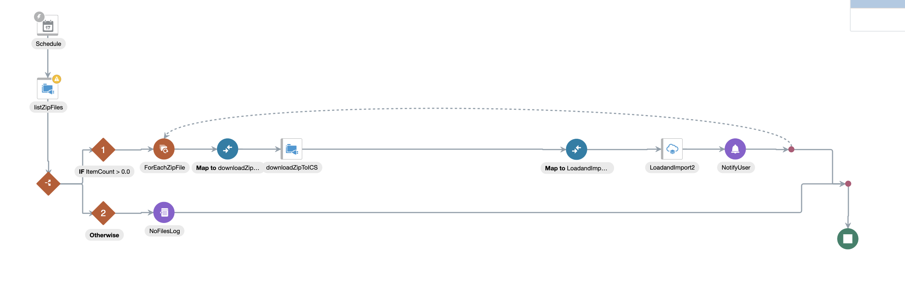
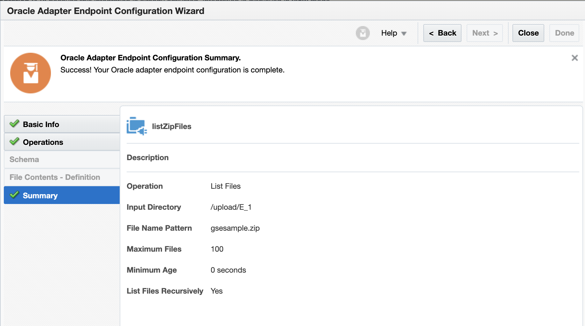
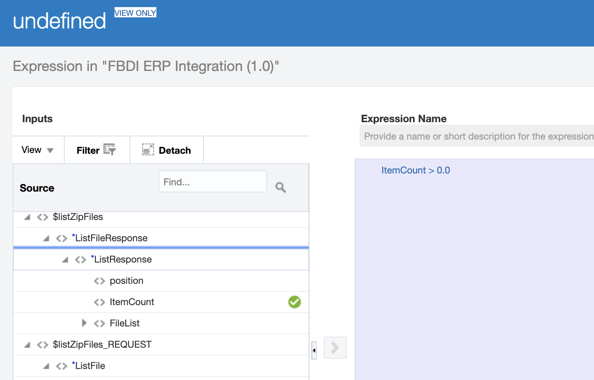
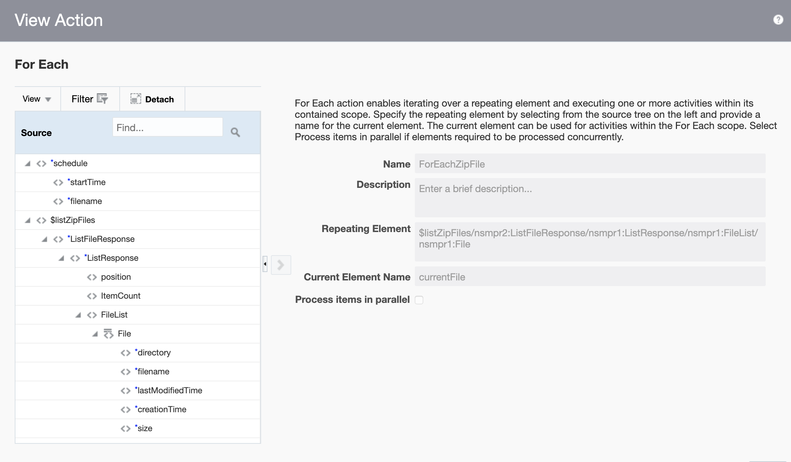
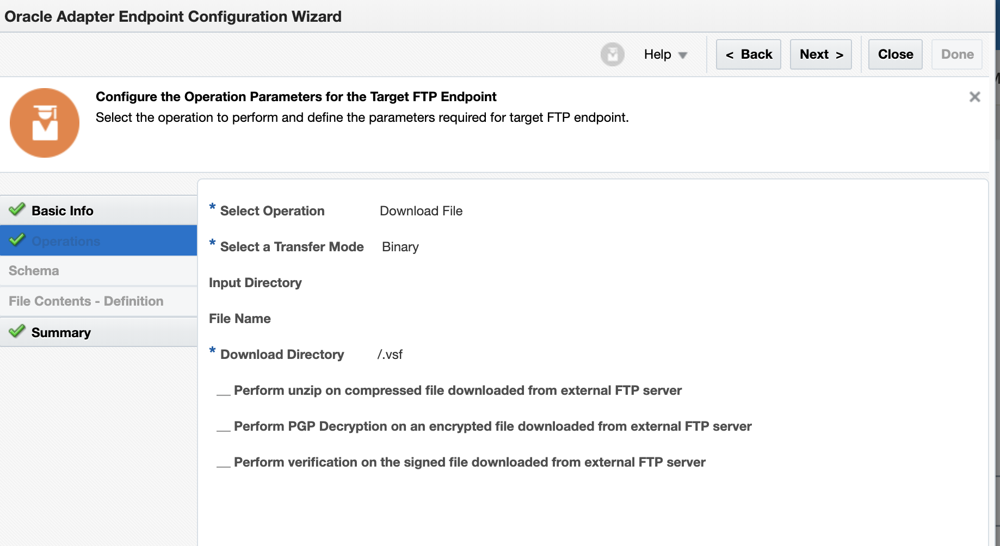
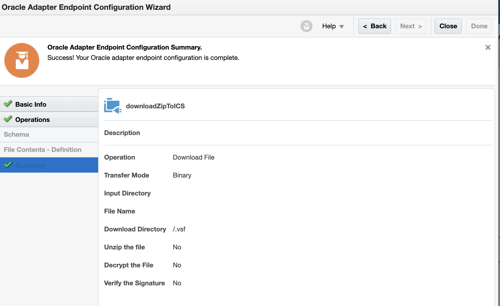
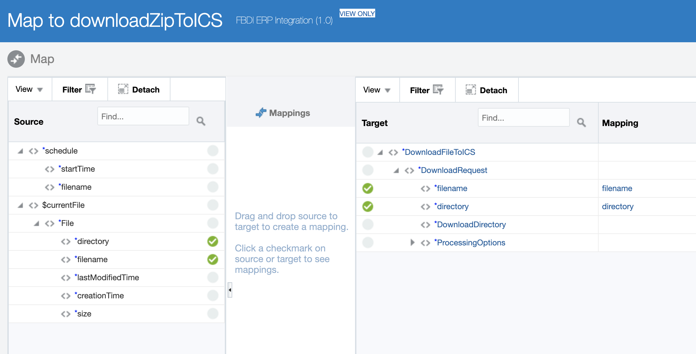
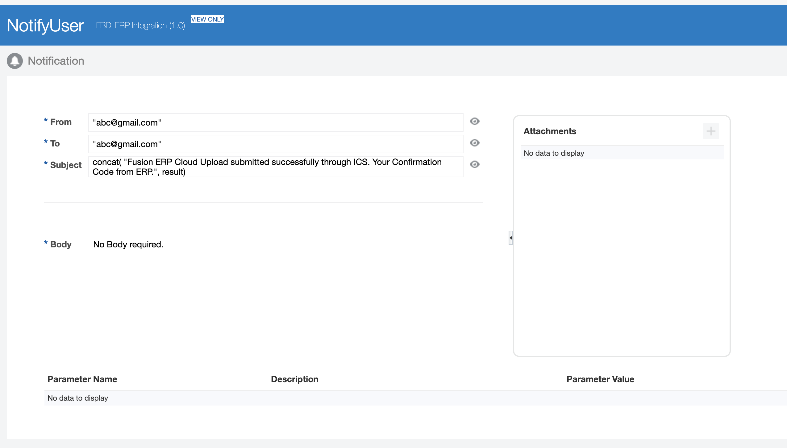

# Using FBDI with ERP Adapter

This lab is a continuation from this longer [Fusion workshop](https://github.com/GaryHostt/Fusion_PurchaseOrder_Integration/blob/master/README.md).


## Pre-Requisites:
1. Create connection to FTP
2. Connect ERP adapter
	


# Create FBDI Integration

Before reaching this point, you should have already connected to your ftp system, if not see this [documentation](https://docs.oracle.com/en/cloud/paas/integration-cloud/ftp-adapter/index.html).

By the end of this section, you will have an integration that looks like this. 



This integration will check if there are files in your FTP server, download the files to oic, then upload them to your ERP environment.

First, configure the connection to the FTP server. The summary screen should look like this. You do not need to specify a schema.



Next, add in a switch statement after the listZipFiles connection. Edit the "if" by clicking on the pencil. In the popup interface, drag itemCount from the source to the right hand side. Now search through the operators until you find the ">" operator, and drag it next to itemCount. Type "0.0" after the greater than operator. Validate and close.



Add a for each loop within the if statement and place another connection to the FTP system within it.



When configuring your second FTP connection, select "Download File" for your operation, "Binary" for transfer mode, then list your directory.



The summary page should look like this.


In the mapper, drag the directory and filename from the source to the corresponding fields in the target connection. Validate and close.



Still within the for each loop, add in your ERP connection.

*insert stuff here explaing how to configure it*

In the mapper, drag the FileReference from the source to the corresponding field in the target ERP connection.


Last, add in a notify user event, that will send a notification when files are uploaded to the ERP instance. Place it after the ERP connection within the for each loop. Enter in the email of the user and paste the following in the subject line.

```
concat("Fusion ERP Cloud Upload submitted successfully through ICS. Your Confirmation Code from ERP:", result)
```

Save and close.



